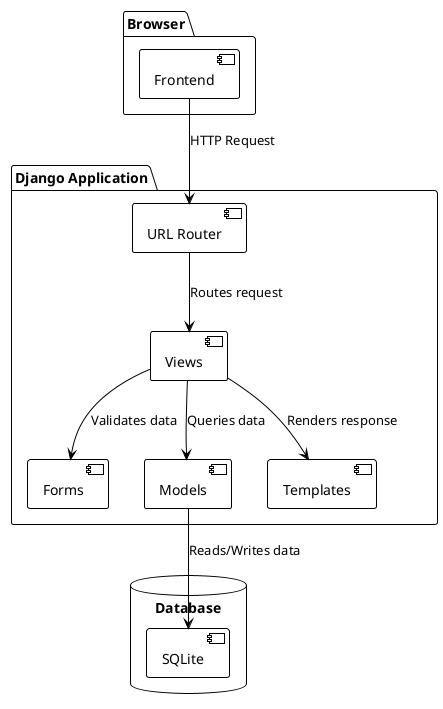

# Complete Project Report: SGICG - Sistema de Gestión de Certificados

## 1. Project Overview

### 1.1. Name and Purpose

-   **Name:** SGICG - Sistema de Gestión de Certificados
-   **Purpose:** A web application for managing the workflow of a gem certification laboratory.
-   **Business Goal:** To streamline the process of receiving, tracking, and certifying gems and jewelry, while providing accurate estimates for delivery times.

### 1.2. Problem Solved and Target Audience

The application solves the problem of manually tracking certification orders, which can be inefficient and error-prone. It provides a centralized system for managing the entire workflow, from order creation to final certification. The target audience is the laboratory staff, including administrators, technicians, and photographers.

### 1.3. Main Workflows

-   **Creating an Order:** A user initiates a new order by providing a unique order number.
-   **Adding Items:** The user adds one or more items (gems or jewelry) to the order, each with specific details like type, weight, and metal.
-   **Certification Process:** Each order progresses through a series of stages:
    1.  **Ingreso (Entry):** The item is received and registered in the system.
    2.  **Fotografía (Photography):** Professional photos of the item are taken and uploaded.
    3.  **Revisión (Review):** The item is analyzed and its characteristics are documented.
    4.  **Impresión (Printing):** The final certificate is printed.
-   **Time Calculation:** The system automatically calculates a suggested delivery date for each order based on the items it contains and the laboratory's business hours.

## 2. System Architecture

### 2.1. General Layout

The project follows a standard Django project structure. See `[ARCHITECTURE.md](./ARCHITECTURE.md)` for more details.

### 2.2. Frontend-Backend Communication

The application primarily uses server-side rendering with Django templates, with AJAX calls for dynamic features like the suggested delivery date calculation. See `[API.md](./API.md)` for more details on the API endpoints.

### 2.3. File and Folder Roles

-   `/certificacion/`: The core Django app containing the business logic.
-   `/templates/`: HTML templates.
-   `/static/`: CSS, JavaScript, and other static assets.
-   `/media/`: User-uploaded files (QRs, photos).

### 2.4. Architecture Diagram



## 3. Setup and Local Execution

### 3.1. Prerequisites

-   Python 3.12+
-   pip

### 3.2. Step-by-Step Instructions

1.  **Clone and set up the environment:**
    ```bash
    git clone <repository-url>
    cd <repository-directory>
    python -m venv venv
    source venv/bin/activate
    ```
2.  **Install dependencies:**
    ```bash
    pip install -r requirements.txt
    ```
3.  **Set up the database and server:**
    ```bash
    python manage.py migrate
    python manage.py createsuperuser
    python manage.py runserver
    ```

### 3.3. File Storage

User-uploaded files are stored in the `/media/` directory, organized by order and item.

### 3.4. SQLite WAL Mode

For better concurrency with SQLite, it is recommended to enable WAL (Write-Ahead Logging) mode. This can be done by connecting to the database and running the command `PRAGMA journal_mode=WAL;`.

## 4. Environment Configuration

The project uses Django's `settings.py` for configuration. For production, it is recommended to use environment variables for sensitive settings.

-   `SECRET_KEY`: A secret key for a particular Django installation.
-   `DEBUG`: Should be `False` in production.
-   `DATABASES`: Database connection settings.

## 5. Models and Database Schema

See `[ERD.md](./ERD.md)` for a detailed diagram of the database schema.

## 6. Views, Endpoints, and APIs

See `[API.md](./API.md)` for a complete list of all URL endpoints and their descriptions. See `[POSTMAN_COLLECTION.json](./POSTMAN_COLLECTION.json)` for a collection of API requests.

## 7. Core Business Logic

### 7.1. Certification Process

The certification process is managed through the `estado_actual` field in the `Orden` model, which can have one of the following values: `INGRESO`, `FOTOGRAFIA`, `REVISION`, `IMPRESION`, `FINALIZADA`.

### 7.2. Suggested Delivery Time Calculation

The system calculates the suggested delivery time based on:
-   The total estimated time for each item in the order, as defined in the `ConfiguracionTiempos` model.
-   The laboratory's business hours:
    -   Mon–Fri: 9:00–17:30
    -   Sat: 9:00–13:00
    -   Sun: Closed
-   The logic in `certificacion/business_hours.py` handles these calculations.

## 8. Frontend Templates and JavaScript Behavior

-   **`crear_orden.html`:** A multi-step wizard for creating new orders and adding items. The JavaScript in this template handles the step transitions, form validation, and AJAX calls.
-   **Modals and Wizards:** The "Add Item" modal is a key feature, and its state is managed by the `resetWizard` JavaScript function to ensure it resets correctly between uses.

## 9. Testing and Verification

-   **Running Tests:** The project includes a suite of Django tests that can be run with the command:
    ```bash
    python manage.py test certificacion
    ```
-   **Manual Test Cases:**
    1.  **Create an Order:** Navigate to the "Create Order" page, fill in the form, add at least one item, and submit.
    2.  **Add Multiple Items:** After adding one item, open the "Add Item" modal again and add a second item to ensure the form has reset correctly.

## 10. Logging, Debugging, and Common Issues

-   **Logging:** The project is configured to log to the console. For more detailed logging, you can configure a logging setup in `settings.py`.
-   **Common Issues:**
    -   `database is locked`: This error occurs with SQLite under high concurrency. The recommended solution is to switch to PostgreSQL.
    -   **Blank Modal:** The "Add Item" modal appearing blank was a bug that has been fixed by improving the `resetWizard` function.

## 11. Migrations and Deployment

-   **Migrations:** To apply database migrations, run `python manage.py migrate`.
-   **Deployment:** For production, it is strongly recommended to:
    -   Switch to a more robust database like PostgreSQL.
    -   Set `DEBUG = False` in `settings.py`.
    -   Use a production-ready web server like Gunicorn or uWSGI.

## 12. Maintenance and Performance

-   **Database:** For SQLite, periodically run `VACUUM;` to optimize the database file.
-   **Dependencies:** Keep dependencies up to date by regularly running `pip install -U -r requirements.txt`.

## 13. Change Log

See `[CHANGELOG.md](./CHANGELOG.md)` for a history of recent changes.

## 14. TODO / Improvement Plan

See `[TODO.md](./TODO.md)` for a list of planned improvements.

## 15. Appendix

### Key Files

-   `certificacion/views.py`: Contains the core application logic.
-   `certificacion/models.py`: Defines the database schema.
-   `certificacion/forms.py`: Defines the forms for data input.
-   `templates/crear_orden.html`: The main template for creating orders.
