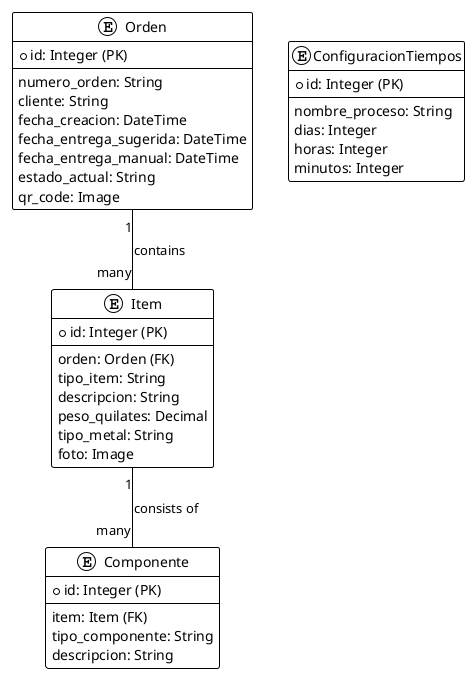

# Entity-Relationship Diagram (ERD)

This document provides a visual representation of the database schema for the SGICG application. The diagram shows the main models (entities) and the relationships between them.

## PlantUML Diagram

## Description of Entities

### 1. Orden (Order)

Represents a single certification order.

-   **`numero_orden`**: A unique identifier for the order.
-   **`cliente`**: The name of the client who placed the order.
-   **`fecha_creacion`**: The date and time when the order was created.
-   **`fecha_entrega_sugerida`**: The automatically calculated suggested delivery date.
-   **`fecha_entrega_manual`**: A manually set delivery date, which overrides the suggested date.
-   **`estado_actual`**: The current stage of the order in the certification workflow (e.g., `INGRESO`, `FOTOGRAFIA`).
-   **`qr_code`**: An uploaded image of the QR code for the order.

### 2. Item

Represents a single item (e.g., a gem or a piece of jewelry) within an order.

-   **`orden`**: A foreign key relationship to the `Orden` it belongs to.
-   **`tipo_item`**: The type of the item (e.g., `gema`, `joya`).
-   **`descripcion`**: A textual description of the item.
-   **`peso_quilates`**: The weight of the item in carats.
-   **`tipo_metal`**: The type of metal, if the item is a piece of jewelry.
-   **`foto`**: An uploaded photo of the item.

### 3. Componente (Component)

Represents a component of an item, such as a decorative stone on a piece of jewelry.

-   **`item`**: A foreign key relationship to the `Item` it belongs to.
-   **`tipo_componente`**: The type of the component.
-   **`descripcion`**: A textual description of the component.

### 4. ConfiguracionTiempos (Time Configuration)

Stores the estimated time required for different processes and item types. This is used to calculate the `fecha_entrega_sugerida`.

-   **`nombre_proceso`**: The name of the process or item type (e.g., `tiempo_gema`, `tiempo_joya`).
-   **`dias`**, **`horas`**, **`minutos`**: The estimated time for the process.
